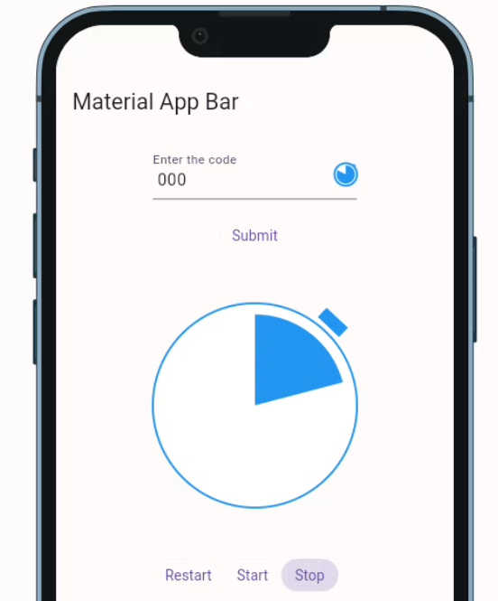

# Flutter Animated Timer Icon
A small widget that can be used as an icon to indicate the remaining time can be used as a suffix for a text field or a larger icon.

## Usage

To use the Animated Timer Icon, you first need to import it into your widget file:

```
import 'package:flutter_animated_timer_icon/flutter_animated_timer_icon.dart';

```

Once you have imported, you can use it as follows:

```
  final animateTimerController = AnimateTimerController();

   AnimateTimer(
        animateTimerController: animateTimerController,
        size: 200,
        color: Colors.blue,
        animationDuration: 10,
        animationBehaviorPreserve: true,
    )
```

you can control the animation using the controller.:
```
...
    onPressed: () {
        animateTimerController.restart();
    }
...                 
    onPressed: () {
        animateTimerController.start();
    }
...                           
    onPressed: () {
        animateTimerController.stop();
    }
...

```